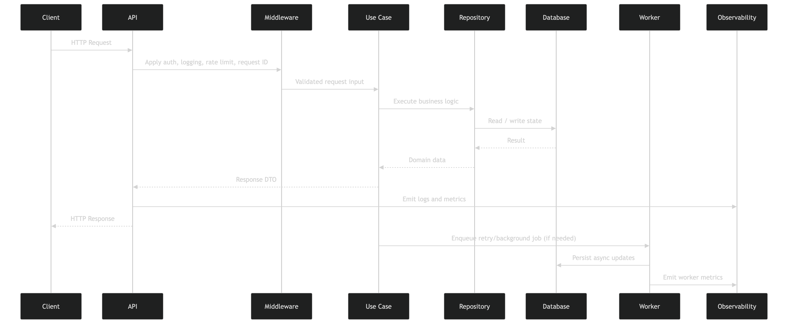
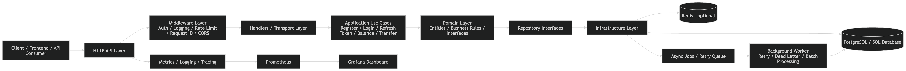

# Backend-Path

[](https://github.com/AbdullahOztoprak/Backend-Path/actions/workflows/ci.yml)

Secure, layered Go backend for authentication, balances, and transfer workflows with production-minded engineering practices.

## Why This Project Matters
Backend-Path demonstrates practical backend concerns that matter in real systems: clear architectural boundaries, secure middleware, transactional data access patterns, and CI reliability.

## Current Status
Active development with core API and architecture in place.

## Implemented
- Layered structure under `internal/api`, `internal/application`, `internal/domain`, and `internal/infrastructure`.
- HTTP routing standardized on `gorilla/mux` + `net/http`.
- Middleware chain including request ID, logging, recovery, CORS, auth, RBAC, and rate limiting.
- Use cases for registration, login, refresh token, transfer, transaction listing, and balance retrieval.
- PostgreSQL and Redis infrastructure adapters.
- Worker modules for retry/dead-letter style background processing.
- Metrics and health-related observability components.
- CI workflow for dependency resolution, vet, build, and tests.

## In Progress
- Completing production dependency wiring in `cmd/main.go`.
- Expanding integration coverage and deployment hardening.

## Planned
- Deeper performance/load validation.
- Additional deployment safety checks and operational hardening.

## Key Features
- JWT-based auth and refresh flow.
- Protected routes with auth/RBAC middleware.
- Transfer and balance APIs organized by use-case boundaries.
- Request-level reliability middleware and observability hooks.

## Architecture Overview
Backend-Path follows a layered architecture with explicit dependency direction: transport calls use cases, use cases depend on domain contracts, and infrastructure provides concrete adapters.



## Request Flow
Incoming requests pass through middleware before handlers execute. Handlers then delegate to application use cases, which coordinate domain contracts and infrastructure repositories.



## Tech Stack
- Go modules
- `net/http` + `github.com/gorilla/mux`
- PostgreSQL (`lib/pq` currently in persistence setup)
- Redis (`go-redis/v8`)
- JWT (`dgrijalva/jwt-go`, migration to `golang-jwt` planned)
- Prometheus client libraries
- GitHub Actions CI

## Project Structure
```text
Backend-Path/
  cmd/
  configs/
  internal/
    api/
    application/
    domain/
    infrastructure/
    worker/
  pkg/
  test/
  docs/
  deployments/
```

## Quick Start
```bash
go mod download
go build ./...
./scripts/migrate.sh
```

## Local Development
```bash
go test ./... -v
go run ./cmd
```

## Testing
```bash
go test ./... -v
```

Additional suites are organized under `test/unit`, `test/integration`, `test/e2e`, and `test/load`.

## Observability
- Prometheus metrics middleware and handler in `internal/infrastructure/observability`.
- Health endpoint route: `GET /api/v1/health`.
- Logging and request correlation middleware under `internal/api/middleware`.

## API Notes
API base path: `/api/v1`

Currently wired routes include:
- `GET /health`
- `POST /auth/login`
- `POST /auth/refresh`
- `POST /users`
- `POST /transactions` (protected)
- `GET /transactions` (protected)
- `GET /balances` (protected)
- `GET /metrics`

## Demo
Use the E2E tests as executable API usage examples:

```bash
go test ./test/e2e -v
```

## Design Decisions
- Keep transport explicit with `gorilla/mux` + `net/http`.
- Keep business orchestration in use cases.
- Keep domain contracts independent from infrastructure details.
- Keep middleware responsibilities composable and isolated.

## Performance and Benchmarking
A load test script is available at `test/load/k6_load_test.js`. Benchmark-focused hardening is planned as part of the next reliability iteration.

## Roadmap
- Finalize application bootstrap wiring in `cmd/main.go`.
- Expand integration matrix in CI.
- Strengthen deployment safety and rollback practices.

## Contributing
See [CONTRIBUTING.md](CONTRIBUTING.md) for contributor workflow and expectations.

## Release and Versioning
Semantic versioning (`MAJOR.MINOR.PATCH`) with release notes tracked in [CHANGELOG.md](CHANGELOG.md).

## License
No license file is currently included. Add a `LICENSE` file before external redistribution.

For architecture details, see [docs/architecture.md](docs/architecture.md).
